```{r setup, include=FALSE}
knitr::opts_chunk$set(echo = TRUE, message=FALSE, warning=FALSE)
```

## Общее понятие и логика статистического вывода

Статистический вывод (*statistical inference*) представляет собой процесс получения логических выводов о генеральной совокупности и ее свойствах на основании данных выборочного исследования.

На основании выборки исследователь тестирует те или иные гипотезы, часто:

-   о различии статистических совокупностей (представления о распределении семейных обязанностей различаются у мужчин и женщин),
-   о наличии закономерностей (на основе анализа совокупности явлений) об отсутствии случайностей (например, случайности распределения данных в последовательности)

Результатом статистического вывода является статистическое суждение, основывающееся на анализе статистических показателей двух типов:

-   единичной (точечной) оценки (например, среднего значения, факторной нагрузки)

-   интервала (например, доверительного интервала для среднего значения, коэффициента корреляции или другого статистического параметра).

В конечном итоге, принимая во внимание полученные результаты, аналитик принимает решение о принятии или отвержении своей исследовательской гипотезы.

::: callout-tip
Статистический анализ = анализ описательных статистик + статистический вывод
:::

**Логика статистического вывода** представляет собой порядок действий аналитика при проведении статистического анализа. В целом, она не зависит от конкретной проблемы и используемых статистических методов, однако, на практике, благодаря большому репертуару статистических инструментов, конечно, имеет свои особенности.

Типичными являются следующие этапы статистического вывода.

Этапы:

1.  Формулировка статистических гипотез (нулевых и альтернативных), позволяющих подтвердить существующую теорию или доказать авторскую.
2.  Выбор статистического критерия (метода анализа), позволяющего подтвердить гипотезы и расчет его статистических значений.
3.  Определение статистической значимости (p-value) и доверительных интервалов.
4.  Вывод о сохранении нулевых или подтверждении выдвинутых гипотез.

### Статистические гипотезы

**Статистическая гипотеза** - предположение о виде распределения и свойствах случайной величины, которое можно подтвердить или опровергнуть применением статистических методов к данным выборки.

**Нулевая гипотеза** ($H_0$, *null hypothesis*) – содержит предположение об отсутствии различий, влияния фактора, различия значения выборочной характеристики от заданной величины (например, нуля) и т. п. Как правило, Н0 не является для исследователя содержательной гипотезой, т. е. предметом и целью доказательства.

**Альтернативная гипотеза** ($H_1$, *alternative hypothesis*) – другое проверяемое предположение, конкурирующая гипотеза (о наличии различий, взаимосвязей, отсутствии случайности, отличии от нуля и пр.). Обычно, за исключением некоторых случаев, профессиональный интерес исследователя сводится именно к верификации альтернативной гипотезы.

Нулевая гипотеза сохраняется или отвергается исходя из того, насколько *вероятным* оказывается наблюдаемый результат.

Для оценки статистических гипотез используются статистические критерии (математические правила), для которых имеются рассчитанные распределения и по которым эти вероятности можно посчитать.

> **Примеры**: критерии согласия (Пирсона, Колмогорова-Смирнова), проверки на однородность (например, тест Ливиня), параметрические (t-критерий, коэффициент корреляции Пирсона – содержат в формулах средние и дисперсии) и непараметрические критерии (Манна-Уитни, Уилкоксона, часто имеют ранговый характер).

::: {callout-note}
С каждым критерием связана некоторая статистика $S$, которая измеряет отклонение в наблюдаемом процессе от ситуации, соответствующей $H_0$.
:::

В силу случайности извлекаемых выборок случайными оказываются и значения статистики $S$, вычисляемые в соответствии с этими выборками. То есть, если мы много раз будем извлекать выборки из генеральной совокупности, значения статистики будут отличаться, и разница между ними будет носить случайный характер.

<iframe id="example1" src="https://gallery.shinyapps.io/CLT_mean/" style="border: none; width: 100%; height: 720px" frameborder="0">

</iframe>

При справедливости проверяемой гипотезы $H_0$ статистика $S$ подчиняется некоторому распределению $g(𝑆│𝐻_0 )$ (прямая черта обозначает верность какого-то условия, в данном случае - распределение статистики $S$ при условии, что гипотеза $H_0$ верна), например, нормальному распределению, t-распределению, распределению $\chi^2$ и др.

В этом распределении выделяется **два множества: случайных отклонений и критических значений**. Если статистика попадает в область критических значений – нулевая гипотеза отклоняется, в противном случае – нет.

::: {#fig-inf layout-ncol="1"}
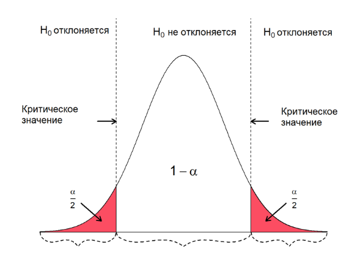

Области критических значений
:::

### Доверительная вероятность и доверительный интервал

Чтобы отклонить нулевую гипотезу, мы выбираем субъективное суждение относительно **уровня риска**, который мы готовы принять для того, чтобы ошибиться. Этот риск оказывается отраженным в понятиях доверительного интервала и доверительной вероятности.

**Доверительный интервал** (*confidence interval*, $CI$) – диапазон, в котором находятся истинные средние значения в генеральной совокупности с определенной доверительной вероятностью.

**Доверительная вероятность** (*confidence level*, $CL$) – вероятность того, что доверительный интервал содержит значение оцениваемого параметра.

Типичные значения доверительной вероятности – 90%, 95% (чаще всего), 99%. Чем больше доверительная вероятность, тем шире (и иногда бесполезнее) интервал.

**Пример**: с 95% вероятностью можно утверждать, что данного мнения о реализации национального проекта придерживаются 48% до 73% жителей региона.

### Ошибки при оценке статистических гипотез

**Ошибка первого рода** – показывает вероятность того, что мы найдем различия там, где их на самом деле нет! **Нездоровые сенсации, большой вред** (Пример: человека признали виновным, а вины нет)

Можем контролировать путем подбора порога значений, ниже которого будем считать, что различий нет, то есть уровня значимости.

Типичный порог – $\alpha$ = 0,05.

**Ошибка второго рода** – различия есть, но мы их не нашли. **Близорукость, слепота критерия, мы ее не можем контролировать!** Вред небольшой.

Минимизировать ошибку второго рода можно путем подбора статистического критерия.

Ошибку первого рода можно совершить, только, если мы отвергли $H_0$, а ошибку второго рода – если мы приняли $H_0$. Сразу две ошибки совершить нельзя!

Оптимальная величина α (критический уровень значимости) должна удовлетворять двум противоречивым требованиям:

1)  Она должна быть достаточно мала, чтобы обеспечить высокое доверие к выводу об отклонении $H_0$

2)  Но она должна быть достаточно велика, чтобы реже допускать ошибки 2-го рода

При этом вероятность ошибки 𝛽 уменьшается при увеличении значения 𝛼, а для фиксированного значения 𝛼:

-   при увеличении объема выборки;
-   при уменьшении выборочной дисперсии.

::: {#fig-error}
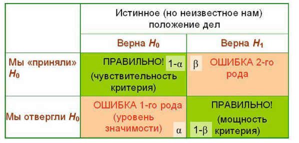{width="60%"}

Ошибки первого и второго рода
:::

### Односторонние и двусторонние критерии. Определение достигнутого уровня значимости

В случае **одностороннего критерия (one-tailed, one-sided)** полученное значение статистики $S^*$ сравнивают с критическим значением $𝑆_{(1−\alpha)}$ при заданном уровне значимости $\alpha$ или делают вывод на основе «достигнутого уровня значимости» (p-value): вероятности возможного превышения полученного значения статистики при справедливости $H_0$.

Односторонний критерий применяется для оценки направленных гипотез, в которых содержатся утверждения «больше (выше)» или «меньше (ниже)».

**Пример**: уровень доверия к некоммерческим организациям у женщин выше, чем у мужчин.

::: {#fig-one-sided}
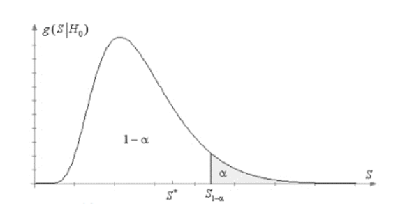{width="60%"}

Графическая интерпретация одностороннего статистического критерия
:::

В случае **двустороннего критерия (two-tailed, two-sided)** критическая область состоит из двух частей. И проверяемая гипотеза $H_0$ отклоняется, если $S^∗>𝑆_{(\alpha/2)}$ или $S^∗<S_{1-\alpha /2}$.

Двусторонний критерий применяется для оценки ненаправленных гипотез (действуют в обе стороны), в которых содержатся утверждения «отличается» или «не равен».

**Пример**: уровень доверия к некоммерческим организациям у женщин у мужчин различается.

::: {#fig-two-sided}
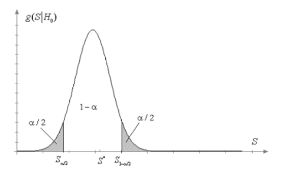{width="60%"}

Графическая интерпретация двустороннего статистического критерия
:::

### Мощность статистического критерия

Мощность статистического критерия — это способность критерия обнаружить эффект, в случае если этот эффект действительно существует. С точки зрения статистики, это вероятность справедливого опровержения нулевой гипотезы.

При проверке любой статистической гипотезы желательно использовать наиболее мощный критерий, который для заданной вероятности $𝛼$ ошибки 1-го рода обеспечивает минимальную вероятность $𝛽$ ошибки 2-го рода относительно любой конкурирующей гипотезы $H_1$.

Желательно всегда, если позволяют данные, применять более мощный критерий, так как это позволяет избежать ошибки 2-го рода.

::: {#fig-power}
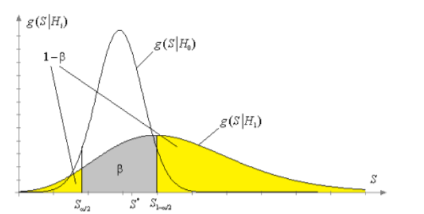{width="60%"}

Плотности распределения статистик при справедливости гипотез $H_0$ и $H_1$ в случае применения двустороннего критерия.
:::

### Выбор метода для анализа

Выбор метода, с помощью которого будут анализироваться данные, осуществляется еще на этапе разработки программы научного исследования на основе его целей и задач, определяющих общий дизайн, методологические подходы и основные показатели исследования. Сразу, на «берегу», если исследователь делает выбор в пользу «количественной» аналитический стратегии, решается вопрос относительно объема и принципов формирования выборочной совокупности, необходимой для получения достаточных данных для доказательства исследовательских гипотез, а также обрисовываются контуры инструментария исследования, в который оказываются вплетены не только тщательно операционализированные и эмпирически интерпретированные понятия, но и подразумеваемые уровни измерения социологических явлений и феноменов, от которых будет зависеть выбор конкретного статистического метода. Так, например, в исследовании перспектив развития гражданского общества в регионах России может ставиться исследовательский вопрос об участии граждан в деятельности общественных, благотворительных организаций.

От того, в какой форме будет задан вопрос, как будет сформулирована исследовательская задача: от простого установления факта такого участия (что может быть достигнуто вопросом: «Участвуете ли Вы в деятельности какой-либо общественной организации или благотворительного общества?") до количественного измерения вклада в деятельность НКО путем определения временных или трудозатрат («Сколько часов своего личного времени Вы тратите на общественную деятельность?», «Если перевести затраченное время в денежный эквивалент, согласно получаемой Вами зарплате на основном месте работы, сколько Вы тратите на помощь общественной организации?») будет зависеть, к какому уровню измерения (категориальному или уровню отношений) будут отнесены данные, и какой статистический метод может быть использован для проверки гипотез о том, какие слои населения в большей степени принимают участие в деятельности общественных организаций, или какие профессионалы вносят больший вклад, участвуя в программах pro bono.

Чтобы выбрать метод, с помощью которого можно было бы проверить статистические гипотезы, нужно выполнить ряд простых действий:

-   Уточнить тип данных (количественные или качественные)
-   В случае количественных данных уточнить тип распределения (нормальное или отличное от нормального)
-   Уточнить количество сравниваемых групп (если они есть)
-   Уточнить, связаны ли группы сравнения между собой, т. е. являются ли единицы наблюдения в группах разными носителями признака (независимые группы), или это одни респонденты, которых опрашивали несколько раз (связанные группы).

Ответы на эти вопросы будут определять выбор статистического метода.

Примерная схема принятия решения для случая, когда планируется сравнивать выраженность количественного признака в одной или нескольких группах, может быть следующей:

```{mermaid}
flowchart LR
  A[Сколько групп сравнивается?] -->F[1]
  subgraph Сравнение с заданным значением
  F-->|Параметрические|O[z-критерий \n t-критерий]
  F-->|Непараметрические|P[Критерий \n Уилкоксона]
  end
  A-->D[2]
  A-->J[3+]
  subgraph Зависимые группы
  D-->|Параметрические|T[t-критерий \n для парных \n выборок]
  D-->|Непараметрические|L[Критерий \n Уилкоксона]
  J -->|Параметрические|K[Дисперсионный анализ \n для повторных \n измерений]
  J-->|Непараметрические|M[Критерий \n Фридмана]
  end
  A-->R[2]
  A-->Q[3+]
  subgraph Независимые группы 
  R-->|Параметрические|S[t-критерий для \n независимых выборок]
  R-->|Непараметрические|U[U-критерий \n Манна-Уитни]
  Q-->|Параметрические|W[Однофакторный \n дисперсионный анализ]
  Q-->|Непараметрические|Y[Непараметрический \n дисперсионный анализ\n Краскела-Уоллиса]
  end
```

Если в центре анализа находятся качественные данные, то рассуждения аналитика могут выстраиваться таким образом:

```{mermaid}
flowchart LR
  classDef dark color:#fff,fill:#0d5caa
  A[Сколько групп сравнивается]-->B[Одна]
  A-->C[Две]
  A-->D[Три и больше]
  subgraph Сравнение с заданным значением
  B-->E[z-критерий]
  end
  subgraph Зависимые группы
  C-->F[Критерий Мак-Немара]
  D-->G[Q-критерий Кокрена]
  end
  A-->K[Две]
  A-->L[Три и больше]
  subgraph Независимые группы
  K-->I[Хи-квадрат Пирсона]
  L-->J[Хи-квадрат Пирсона с поправкой на правдоподобие]
  end
  class C,K,F,I dark
```

Рассмотрим каждый из приведенных критериев подробнее.

## Сопоставление количественных результатов с заданным значением

### z-критетий и t-критерий Стьюдента для одной выборки

В том случае, когда мы имеем какой-либо количественный показатель и хотим сравнить со средним значением в генеральной совокупности, которое известно заранее (из ранее проведенных исследований, регламентов, переписей населения и др. источников), мы можем для этого использовать z и t-критерии.

Оба теста преследуют весьма сходные цели - сравнить выборочные средние значения с гипотетическими значениями, и являются *параметрическими*, что означает соблюдение требования о непрерывности распределения и нормальности данных.

Их отличия кроются в используемых статистических распределениях (z - критерий использует нормальное распределение, тогда как t-критерий, естественно, t-распределение с более «тяжелыми» хвостами, что делает его более консервативным), а также отношение к стандартному отклонению. Если стандартное отклонение в генеральной совокупности известно, предпочтительнее использовать z-критерий, если его нет - одновыборочный критерий Стьюдента.

#### z-критерий

Для того, чтобы корректно использовать z-критерий для тестирования гипотез, необходимо выполнять следующие требования:

-   показатель, который мы исследуем, в генеральной совокупности должен иметь нормальное распределение (оценить на практике практически нереально, но мы можем сделать проверку выборочного распределения в качестве «прокси»);
-   наблюдения в выборке должны быть независимыми, а сама выборка - случайной
-   мы должны знать стандартное отклонение в генеральной совокупности
-   размер выборки должен быть достаточно большим, по меньшей мере $n > 30$.

Какие гипотезы мы формулируем, когда используем z-критерий?

Что касается нулевой гипотезы, то здесь все просто:

$H_0: \bar{x}=\mu_0$ – выборочное среднее равно предполагаемому среднему в генеральной совокупности

А вот альтернативная гипотеза может быть сформулирована тремя возможными способами:

-   $H_{a1} : \bar{x}<\mu_0$ – выборочное среднее меньше предполагаемого среднего значения (левостронний тест)
-   $H_{a2} : \bar{x}>\mu_0$ – выборочное среднее больше предполагаемого среднего значения (правосторонний тест)
-   $H_{a3} : \bar{x} \neq \mu_0$ – выборочное среднее отличается от предполагаемого среднего значения (двусторонний тест)

Формула для расчета z-критерия: $$z=\frac{\bar{x}-\mu_0}{\sigma \ \sqrt{n}},$$

где: $\bar{x}$ – выборочное среднее $\mu_0$ – гипотетическое среднее, с которым мы сравниваем выборочное среднее $n$ – объем выборки $\sigma$ – гипотетическое стандартное отклонение

>  **Пример**: Предположим, вы хотите оценить уровень удовлетворенности студентов материально-техническим оснащением на вашем университетском кампусе. Ваша гипотеза состоит в том, что средний уровень удовлетворенности составляет 6.5, что было определено в результате прошлогоднего исследования, и хотите проверить, верно ли это. Вы знаете, что стандартное отклонение оценок составляет 1,4.

> Вы случайным образом отобрали 100 студентов и попросили их оценить свой уровень удовлетворенности по шкале от 1 до 10. После сбора данных, вы рассчитали среднюю оценку уровня удовлетворенности студентов, которая оказалась равной 6,8, со стандартным отклонением 1,2.

Сгенерируем аналогичные данные с помощью функции `rnorm()`:

```{r eval=TRUE}
set.seed(123)
data<-rnorm(n=100, mean = 6.8, sd = 1.2)
```

Поскольку мы заранее определили, что наши данные происходят из нормального распределения, довольно бессмысленно их проверять на нормальность. В доказательство сделаем гистограмму:

```{r}
#| label: fig-hist-for-z-test
#| fig-cap: "Проверка данных на нормальность графическим способом"
hist(data)
```

Установим пакет `BSDA`:

```{r eval=FALSE}
install.packages("BSDA")
```

Посчитаем статистику теста:

```{r}
library("BSDA")
z.test(data,
alternative = "two.sided",
mu = 6.5,
sigma.x = 1.4,
conf.level = 0.95
)
```

Результаты теста показывают, что оценка удовлетворенности студентов значимо отличается от гипотетической.

Визуально это можно представить в виде графика, показывающего, насколько далеко полученное z-значение находится от нулевой отметки, символизирующей отсутствие отличий эмпирического и теоретического средних значений. Поскольку мы использовали ненаправленную гипотезу (средние отличаются, но не понятно, как именно) и двусторонний тест, то и вероятности мы будем считать тоже как бы «в обе стороны». По тесту у нас получилось p-значение = 0,003 (вероятность ошибочно отвергнуть нулевую гипотезу составляет 0.3%) и мы разбиваем его на две части - по 0,0015 (около 0,15%) с каждой стороны.

```{r echo=FALSE}
#| label: fig-plotztest
#| fig-cap: "Графическая интерпретация z-теста (двусторонний критерий)"
library(nhstplot)
plotztest(z=2.9178, tails = "two")
```

Если бы мы ставили гипотезу о том, что получившееся среднее превышает гипотетическую величину (мы предполагали бы, что оценка удовлетворенности выросла), то есть использовали бы *направленную* гипотезу и, соответственно, односторонний критерий, то результаты были бы следующими:

```{r echo=FALSE}
#| label: fig-plotztest2
#| fig-cap: "Графическая интерпретация z-теста (односторонний критерий)"
library(nhstplot)
plotztest(z=2.9178, tails = "one")
```

#### Одновыборочный t-критерий

Одновыборочный t-критерий «ведет себя» в целом аналогично z-критерию: он также применяется к данным, подчиняющимся закону нормального распределения.

Нулевая гипотеза:

-   $H_0:m=μ$

Альтернативные гипотезы:

-   $H_a:m≠μ$ (двусторонний критерий)
-   $H_a:m>μ$ (правосторонний)
-   $H_a:m<μ$ (левосторонний)

Формула:

$$t = \frac{m-\mu}{s/\sqrt{n}}$$

Разберем возможности применения критерия на следующем примере.

>  **Пример 2**: Минимальный размер оплаты труда в Алтайском крае в 2024 году составлял 20 454 руб. Вы работаете в научно-исследовательском центре и занимаетесь социально-экономическими исследованиями. В результате опроса населения были получены следующие данные о заработной плате жителей одного из сел. Докажите, что среднее значение в выборочной совокупности отличается от установленного минимального размера заработной платы в регионе.

Рассмотрим следующие данные:

```{r}
data<-c(18431, 21211, 18200, 17502, 25581, 29684, 30319, 27533, 15328, 30801, 18650, 22702, 17807, 35468, 17693, 17966, 21690, 19580, 24581, 25817, 28493, 33954, 22030, 22300, 16290, 15371, 26745, 20320, 21226, 20522)
```

Вычислим t-критерий, сравнив выборочное среднее с минимальным размером оплаты труда

```{r}
t_test <- t.test(data, mu = 20454)
t_test 

```

Результаты анализа указывают на то, что средняя зарплата в данном населенном пункте достоверно отличается от минимального размера оплаты труда в регионе ($t_{29}=2,3188, p=0,028$). Мы видим, что сравниваемое значение 20454 не попадает в 95% интервал, границы которого определяются значениями 20730,0 и 24856,33. Откуда, кстати, берутся эти значения?

Это станет понятным, если взглянуть на формулу доверительных интервалов для t-критерия: $$\left( \bar x + t_{n-1, \alpha / 2} \cdot \frac{s}{\sqrt{n}},
  \bar x + t_{n-1, 1 - \alpha / 2} \cdot \frac{s}{\sqrt{n}} \right)$$,

где:

-   $\bar{x}$ - среднее значение
-   $t_{n-1, \alpha / 2}$ - квантиль $\alpha /2$ t-распределения с $n-1$ степенями свободы
-   $s = \sqrt{\frac{1}{n-1} \sum_{i=1}^n (x_i - \bar{x})^2}$ - выборочное стандартное отклонение
-   $n$ - размер выборки

Попробуем воспроизвести доверительные интервалы, используя возможности библиотеки `distributions3`:

```{r}
#install.packages("distributions3")
library(distributions3)
T_9<-StudentsT(df=29)
mean(data) + quantile(T_9, 0.05 / 2) * sd(data) / sqrt(30)
mean(data) + quantile(T_9, 1 - 0.05 / 2) * sd(data) / sqrt(30)
```

Мы получили аналогичные результаты, что нас утверждает в мысли, что мы на правильном пути. Посмотрим, как результаты проверки гипотезы с помощью t-критерия можно представить графически:

```{r echo=FALSE}
#| label: fig-t-test-plot
#| fig-cap: ""
plotttest(t = 2.3188, df = 29, tails = "two")
```

### Критерий Уилкоксона

В том случае, когда по каким-то причинам мы не можем применять параметрические критерии (например, из-за погрешностей в распределении - слишком большой асимметрии), альтернативой z- и t-критериям может являться **критерий знаковых рангов Уилкоксона (Wilcoxon signed-rank test)**. Он был разработат Фрэнком Уилкоксонов в 1945 году, и является одним из самых первых «непараметрических» тестов.

В отличие от рассмотренных выше тестов в нем сравниваются не средние значения, а медианы, что делает тест устойчивым к экстремальным значениям.

Нулевая и альтернативная гипотезы также формулируются в терминах выборочной медианы ($m$), которая сравнивается с другим медианным значением из генеральной совокупности, которое определяет исследователь:

-   $H_0 : m = m_0$
-   $H_1 : m \neq m_0$ (двусторонняя)
-   $H_1 : m > m_0$ (правосторонняя)
-   $H_1 : m < m_0$ (левосторонняя)

Как и в другом тесте здесь есть свои допущения:

-   распределение оценок (различий между эмпирическим и теоретическим значением) должно быть симметричным (то есть должны быть разные данные - те, которые отклоняются от тестируемого значения в положительную сторону и в отрицательную сторону, в противном случае, тест проводить не стоит);
-   выборка должна быть случайной, а наблюдения независимыми друг от друга.

Одновыборочный тест Уилкоксона основан на следующей тестовой статистике. Могут быть использованы два способа подсчета, которые приводят к идентичным результатам.

Обозначим первый как $W_1$ (также известный как $T$), а второй как $W_2$. Для того, чтобы посчитать статистику критерия по каждому способу, нужно осуществить следующие действия:

1.  Для каждого значения выявить знак отличия с теоретическим значением: $sign_d=sgn(score−m_0)$ . Показатель $sign$ равен 1, если различия больше нуля, -1, если различия меньше нуля, и 0 - если равны нулю.
2.  Для каждого значения посчитать абсолютную разницу с теоретическим значением: $|score−m_0|$.
3.  Удалить значения, различия по которым равны нулю (по этому поводу есть несколько спорных мнений - удалять или не удалять, а сдвигать значения на небольшую константу, но мы будем следовать «классическому объяснению»). После удаления «нулей» окончательный объем выборки становится равным $N_r$.
4.  Присвоить ранги $R_d$ всем абсолютным разностям в $N_r$. Наименьшему значению присваивается ранг 1, а наибольшему - ранг, соответствующий $N_r$. Если есть повторные ранги (ties), то они заменяются на средние значения.

Далее необходимо посчитать сумму рангов, соответствующих положительным различиям: $W_1=\Sigma R^+_d$

и

$W_2=\Sigma sign_d × R_d$ (то есть просто умножить разницу на знак, а затем суммировать все произведения).

Распределение статистики $W_1$ при условии, что верна нулевая гипотеза ($H_0$) и $N_r$ достаточно большое, приближается к нормальному со средним значением $\mu W_1$ и стандартным отклонением $\sigma W_1$, которые рассчитываются по следующим формулам:

$$\mu_{W_1} = \frac{N_r(N_r + 1)}{4}$$ и

$$\sigma_{W_1} = \sqrt{\frac{N_r(N_r + 1)(2N_r + 1)}{24}}$$

Следовательно, стандартизированная z-статистика принимает следующий вид:

$$z = \frac{W_1 - \mu_{W_1}}{\sigma_{W_1}}$$

Распределение статистики $W_2$ при достаточно большом количестве выборки также имеет нормальное распределение со средним значением $0$ и стандартным отклонением $\sigma W_2$:

$$ \sigma_{W_2} = \sqrt{\frac{N_r(N_r + 1)(2N_r + 1)}{6}}$$

Стандартизированная статистика рассчитывается в этом случае по формуле:

$$z = \frac{W_2}{\sigma_{W_2}}$$

Если выборки маленькие (менее 50 наблюдений), следует использовать точные распределения.

Вернемся к нашему первому примеру и попробуем применить к этим же данным тест Уилкоксона:

```{r}
set.seed(123)
data<-rnorm(n=100, mean = 6.8, sd = 1.2)

res <- wilcox.test(data, mu = 6.5)
# Printing the results
res

```

## Сравнение исследуемого признака в двух и более независимых выборках

### t-критерий

Т-критерий для независимых выборок (t-тест, t-критерий Стьюдента) предназначен для сравнения средних в двух независимых группах с целью предоставления статистического обоснования того, что и в основной популяции (генеральной совокупности) соответствующие средние так же различаются. Своим именем этот критерий обязан английскому химику и математику **Уильяму Сили Госсету**, работавшему в конце XIX века на пивоварне Гиннесс в Дублине. Владельцы пивоварни поставили перед ученым весьма амбициозную задачу - сохранить репутацию лучших пивоваров и вывести процесс производства пива на новый уровень, что потребовало проведения исследований в области контроля качества. Как известно, производство пива - процесс не только высокотехнологичный, требующий четкости следования процедурам, но и результат случайного стечения обстоятельств, поскольку натуральные продукты, из которых производится пиво - хмель, ячмень, солод, как и другие сельскохозяйственные культуры, имеют большую степень вариабельности вкусовых качеств из-за влияния состава почвы, климата и других факторов. Задача Госсета как подмастерья пивовара заключалась не только в оценке качества этих продуктов, но и том, чтобы сделать это наиболее экономным и точным образом.

::: {#fig-gosset}
{style="float:left" width="500"}

Памятная табличка в Дублине, на складе пивоварни Гиннесс
:::

Работая с небольшими выборками, Госсет заметил, что распределение средних значений отклонялось от нормального распределения, и, значит, он не мог использовать обычные статистические методы, основанные на нормальном распределении для того, чтобы принимать решения.

В 1904 году Госсет опубликовал внутренний отчет, в котором математически обосновал свой «закон ошибок» среднего (Law of Error) и возможности его применения для нужд пивоварни. В своей работе он описал, что «чем больше наблюдений, по которым рассчитано среднее значение, тем меньше (вероятная) ошибка». Госсет также отметил, что в сравнении с нормальным распределением, «кривая, представляющая частоту ошибок становится выше и уже по мере того, как объем выборки уменьшается. Управление Гинесса предложило Госсету проконсультироваться с другими специалистами, и так состоялась встреча Госсета с Карлом Пирсоном, под руководством которого в 1908 году в журнале «Биометрика» и появляется знаменитая работа Госсета об оценке ошибки среднего, напсанная под псевдонимом Стьюдент. Госсет не мог публиковаться под своим собственным именем, поскольку речь шла о данных, составляющих коммерческую тайну, а завод Гинесса очень строго относился к своим данным. Поэтому, вероятно, под влиянием названия на блокноте, который он использовал для ведения записей (The Student’s Science Notebook), Госсет выбрал такой псевдоним, который он использовал в 19 из своих 21 научных работ (@physocStrangeOrigins).

 **Примеры**: сравнение результатов академической успеваемости в двух группах учащихся, доходов у мужчин и женщин, доверия к социальным институтам среди городских и сельских жителей и др.

Требования:

1.  Зависимая переменная должна быть **непрерывной**, измеренной по интервальной шкале или шкале отношений Независимая переменная - категориальная (номинальная), состоящая из двух и более групп (но мы сравниваем только две)
2.  Для анализа отбираются только случаи, где есть валидные значения по обеим переменным (отсутствующие значения удаляются)
3.  Сравниваемые группы должны быть **независимыми** (должно выполняться требование независимости наблюдений). Что это значит?

-   Между наблюдениями в разных группах нет никаких взаимосвязей, то есть:
-   Субъекты (респонденты) в первой группе не могут быть одновременно и во второй группе (респонденты в каждой группе - разные)
-   Субъекты (респонденты) одной группы никаким образом не могут влиять на субъектов (респондентов) в другой группе (например, в одной группе - родители, в другой - дети, или в одной начальники, а в другой - подчиненные и т. д.) Независимость двух выборок означает, что средние значения «будут совершенно некоррелируемыми для бесконечного множества пар выборок».

4.  Выборка должна быть случайной
5.  Зависимая переменная в каждой группе должна быть нормально распределена Ненормальное распределение, особенно с «тяжелыми хвостами» или слишком большой асимметрией значительно снижает мощность теста (его способность отвергать нулевую гипотезу) В случае если выборка по размеру средняя или большая, нарушениями нормальности можно пренебречь, так как они меньше влияют на величину ошибки $p$.
6.  Гомогенность дисперсий (то есть дисперсии в группах должны быть практически равными) Когда это требование нарушается и размеры групп не совпадают, значению $p$ нельзя доверять.К счастью, R позволяет рассчитать модифицированную статистику t-критерия по формулам, которые не основываются на допущении о равенстве дисперсий. Этот альтернативный критерий носит название t-критерия Уэлча, он также известен под названиями t-критерия для неравных дисперсий (Unequal Variance t-Test или Separate Variances t-Test).
7.  В измерениях не должно быть выбросов (можно проверить по ящичной диаграмме).

Нулевая гипотеза ($H_0$) и альтернативная гипотеза ($H_1$) при использовании t-критерия Стьюдента может быть выражена двумя аналогичными способами:

-   $H_0: \mu_1 = \mu_2$ («средние в двух группах равны»)
-   $H_1: \mu_1 \neq \mu_2$ («средние в двух группах не равны»)

ИЛИ

-   $H_0: \mu_1- \mu_2 = 0$ («различия между средними равны 0»)
-   $H_1:\mu_1 - \mu_2 \neq 0$ («различия между средними в двух группах не равны 0»)

где $µ_1$ и $µ_2$ это средние в генеральной совокупности для группы 1 и группы 2, соответственно. Заметим, что вторая группа гипотез выводится просто путем переноса $\mu_2$ в левую часть уравнения (неравенства) - или путем ее вычитания из обеих частей.

Когда доказано, что две выборки происходят из групп генеральной совокупности с равными дисперсиями $\sigma^2_1=\sigma^2_2$), статистика t-критерия рассчитывается по формулам:

$$t=\frac{\bar{x_1}-\bar{x_2}}{s_p/\sqrt{n_\sigma}}$$

где

$$s_p=\sqrt{\frac{(n_1-1)*s^2_1+(n_2-1)*s^2_2}{n_1+n_2-2}}$$

а

$$n_\sigma=\frac{1}{\frac{1}{n_1}+\frac{1}{n_2}}$$

где $\bar{x_1}$,$\bar{x_2}$ – средние значения в сравниваемых выборках, $n_1, n_2$ – количество наблюдений в первой и второй группах, $s_1, s_2$ – стандартные отклонения в первой и второй группах, $s_p$ – объединенное стандартное отклонение.

Распределение статистики t-критерий является t-распределением Стьюдента с $df$ - степенями свободы. Если гипотеза о равенстве дисперсий подтверждается, то количество степеней свободы подсчитывается по формуле $n_1+n_2-2$.

Когда независимые выборки (и соответствующие им группы в генеральной совокупности) имеют неравные дисперсии (то есть, $𝜎_1^2≠𝜎_2^2$), t-критерий рассчитывается по формуле (известной также как t-критерий Уэлча):

$$t=\frac{\bar{x_1}-\bar{x_2}}{\sqrt{\frac{s^2_1}{n_1}+\frac{s^2_2}{n_2}}}$$ где ($\bar{x_1}, \bar{x_2}$,– средние значения в сравниваемых выборках,$n_1, n_2$ - количество наблюдений в первой и второй группах, $s_1, s-2$ – стандартные отклонения в первой и второй группах.

Количество степеней свободы при этом высчитывается по формуле: $$df=\frac{(\frac{s^2_1}{n_1}+\frac{s^2_2}{n_2})^2}{\frac{1}{n_1-1}(\frac{s^2_1}{n_1})^2+\frac{1}{n_2-1}(\frac{s^2_2}{n_2})^2}$$ Полученная статистика $t$ сравнивается с критическими значениями из таблиц с t-распределения Стьюдента для количества степеней свободы и выбранного уровня значимости α (как правило 0,05). Если рассчитанное значение t больше табличного, мы отвергаем нулевую гипотезу ($H_0$) о равенстве средних значений.

Рассмотрим возможности анализа данных с помощью t-критерия Стьюдента на следующем примере.

>  **Пример**: В нашем исследовании по климату есть переменные, оценивающие важность для коренных народов, проживать на территории традиционного проживания, соблюдать обычаи и этнические традиции, осуществлять традиционную хозяйственную деятельность. Это табличный вопрос **В18**. Создадим усредненное значение по пяти подвопросам данного блока и используем его в качестве обобщенной оценки важности сохранения традиционных основ жизнедеятельности коренных народов, проживающих на высокогорных территориях. Проведем сравнительный анализ средних оценок в различных возрастных группах - в группе молодежи до 35 лет и среди жителей старше 35-летнего возраста.

Загрузим данные:

```{r echo=FALSE}
library(haven)
df<-read_sav("files/База_КлимРиск_2023.sav")
```

```{r eval=FALSE}
library(haven)
df<-read_sav("База_КлимРиск_2023.sav")
```

Посчитаем новую переменную - среднее значение по переменным B18_1 - B18_5 и сделаем гистограмму:

```{r}
library(dplyr)
df<-df |> 
  rowwise() |>  
  mutate(V18_mean=mean(c_across(starts_with("V18")), na.rm = TRUE))
hist(df$V18_mean, col="steelblue")
```

Мы видим, что наши данные весьма далеки от совершенства, и есть значительная отрицательная асимметрия, происходящая оттого, что большинство опрошенных дали самые высокие оценки значимости по всем пяти подвопросам. Строго говоря, с такими данными применять t-критерий не совсем корректно, и любой тест на нормальность это подтвердит.

```{r}
shapiro.test(df$V18_mean)
```

```{r}
t(psych::describe(df$V18_mean))
```

Так и есть, у нас асимметрия превышает допустимые пределы от +1 до -1 (Hair et al., 2022). Но исключительно в учебных целях мы продолжим.

Создадим группирующую переменную по возрасту:

```{r}
df<-df |> 
  mutate(age_bin=case_when(
    age<35 ~ "До 35 лет",
    age>=35 ~ "Старше 35 лет"
      ))
```

Для проверки гомогенности дисперсий в группах проведем лест Ливиня, преимуществом которого является возможность использования, когда в данных есть отклонения от нормальности:

```{r}
library(car)
leveneTest(V18_mean~age_bin, data = df)
```

Судя по тесту, у нас значимые различия в дисперсиях, а значит, если уж использовать t-критерий, то его модифицированную версию Уэлча:

```{r}
t.test(V18_mean~age_bin, data = df)
```

Тест показал наличие значимых отличий в оценке важности традиционной деятельности по возрасту ($t_{414,04}=-3,362, p = 0,001$), указывающих на то, что современная молодежь, проживающая вблизи ледников, в меньшей степени ориентирована на сохранение традиционных ценностей и устоев своего народа.

Создадим визуализацию к результатам теста:

```{r}
#| label: fig-t-test
#| fig-cap: "Ящичная диаграмма по результатам рассчета t-критерия (ggpubr)"
library(ggpubr)
df |>  
  filter(!is.na(age_bin)) |>  
  ggboxplot(x = "age_bin", y = "V18_mean",
          color = "age_bin", palette = "jco", order = c("До 35 лет", "Старше 35 лет"), add = "jitter", xlab = "Возраст", )+stat_compare_means(method = "t.test", label.y = 4.5)
```

Либо как вариант:

```{r}
#| label: fig-t-test2
#| fig-cap: "Ящичная диаграмма по результатам рассчета t-критерия (ggstatsplot)"
library(ggstatsplot)
ggbetweenstats(df, age_bin, V18_mean, xlab = "Возраст")
```

Несмотря на то, что различия статистически достоверны, величина эффекта представляющая собой стандартизованную разницу между средними, невысока: Hedges’ g (метрика, позволяющая оценить различия в средних) составляет всего 0,26, что можно считать очень незначительной разницей (согласно негласным нормам средний эффект наблюдается при g = 0,5, значительный - при g выше 0,8).

### U-критерий Манна-Уитни

Критерий Манна-Уитни (U критерий, также называемый критерием Манна-Уитни-Вилкоксона, MWW/MWU, критерием ранговых сумм Вилкоксона, тестом Вилкоксона-Манна-Уитни) – непараметрический тест, проверяющий нулевую гипотезу о том, что в случайных значениях двух групп X и Y вероятность того, что X больше Y равна вероятности, что Y больше, чем X.

Предложен в 1945 году американским химиком и статистиком Фрэнком Уилкоксоном, доработан австрийским и американским математиком Генри Манном и Дональдом Уитни в 1947 году.

U-критерий Манна-Уитни используется для сравнения выраженности показателей в двух несвязных (независимых) выборках, является непараметрическим аналогом t-критерия Стьюдента.

Требования:

1.  Все наблюдения из двух групп должны быть независимыми друг от друга
2.  Данные должны быть измеренными по крайней мере в порядковой шкале (взяв два значения мы должны точно сказать, какое из них больше)
3.  Нулевая гипотеза $H_0$ предполагает, что распределения в двух группах являются идентичными Альтернативная гипотеза $H_1$ заключается в том, что распределения не идентичны.

Для применения U-критерия Манна — Уитни нужно:

1.  Составить единый ранжированный ряд из обеих сопоставляемых выборок, расставив их элементы по степени нарастания признака и приписав меньшему значению меньший ранг. Общее количество рангов получится равным: $N=n_1+n_2$, где $n_1$ — количество элементов в первой выборке, а $n_2$ — количество элементов во второй выборке.
2.  Разделить единый ранжированный ряд на два, состоящие соответственно из единиц первой и второй выборок. Подсчитать отдельно сумму рангов, пришедшихся на долю элементов первой выборки, и отдельно — на долю элементов второй выборки.
3.  Определить значение U-критерия Манна — Уитни **в каждой группе** по формуле:

$$U_x=T_x-\frac{n_x(n_x+1)}{2},$$ где $T_x$ - сумма рангов.

Меньшее значение и будет итоговым значением критерия.

4.  По таблице для избранного уровня статистической значимости определить критическое значение критерия для данных $n_1$ и $n_2$. Если полученное значение $U$ меньше табличного или равно ему, то признается наличие существенного различия между уровнем признака в рассматриваемых выборках (принимается альтернативная гипотеза). Если же полученное значение $U$ больше табличного, принимается нулевая гипотеза. Достоверность различий тем выше, чем меньше значение $U$.

Проведем тест Манна-Уитни с примером выше:

```{r}
wilcox.test(V18_mean~age_bin, data = df)
```

Результаты аналогичны полученным с помощью t-критерия.

```{r}
#| label: fig-u-test
#| fig-cap: "Ящичная диаграмма по результатам рассчета U-критерия (ggstatsplot)"
library(ggstatsplot)
ggbetweenstats(df, age_bin, V18_mean, xlab = "Возраст", type="nonparametric")
```

### Однофакторный дисперсионный анализ

Дисперсионный анализ (Analysis of Variance, ANOVA) – статистический метод выявления различий между выборочными средними для двух или больше совокупностей.

Существуют различные разновидности дисперсионного анализа, различающиеся по количеству группирующих (факторных) и зависимых переменных, используемых в анализе, типам выборок (независимые наблюдения или повторные эксперименты), наличию кластеров внутри выборки и др.

Самым простым является однофакторный дисперсионный анализ (One-way или one-factor ANOVA), в котором используются одна зависимая и одна независимая переменные.

>  **Например**, нас может интересовать влияние принадлежности к тому или иному социальному классу (низший, средний и высший класс) на показатели здоровья, такие как доступ к медицинским услугам или распространенность хронических заболеваний, или мы могли бы сравнить, как лица с различным уровнем религиозности (высокорелигиозные, со средней религиозностью или совсем не религиозности) оценивают уровень социальной справедливости или проявляют электоральное поведение, а также как уровень потребления медиаконтента (например, заядлые ТВ-зрители или типичные пользователи социальных сетей или читатели определенных газет) взаимосвязан с установками в отношении социальных проблем, так как проблемы миграции или гендерного неравенства.

При этом, мы предполагаем, что исходные значения зависимой переменной можно разложить на несколько компонентов, определяющих различия между ними:

$$x_{ij}=\mu + F_i+ \epsilon_{ij}, $$ где

-   $x_{ij}$ - значение зависимой переменной, полученной на $i-м$ уровне фактора с порядковым номером $j$;
-   $\mu$ - общее среднее значение;
-   $F_i$ - эффект, обусловленный влиянием $i-го$ уровня фактора;
-   $\epsilon_{ij}$ - остаточный член, возмущение, вызванное влиянием неконтролируемых факторов, то есть вариацией переменной внутри уровня.

Гипотезы:

-   $H_0$: $\mu_1=\mu_2=\mu_3=...= \mu_k$
-   $H_1$: не все средние равны (хотя бы между одной парой средних имеются различия)

Дисперсионный анализ сравнивает дисперсии двух видов — внутри групп (связанную со случайными, неконтролируемыми различиями между испытуемыми) и между группами (связанную с влиянием группирующей переменной, или фактора). Как мы увидели выше, при сравнении двух групп t-статистика измеряет разность средних стандартной ошибкой. Дисперсионный анализ измеряет квадрат разности средних квадратами стандартной ошибки, т.е. результат для двух выборок равен квадрату, рассчитанной по этим же данным t-статистики.

**Межгрупповая (факторная) дисперсия** рассчитывается по формуле:

$$MS_b=\frac{SSb}{k-1},$$ где

-   $SS_b=\Sigma n_i(\bar{x_i}-\bar{x})$ - межгрупповая сумма квадратов отклонений среднего значения в каждой группе от общего среднего;
-   $k-1$ - степень свободы (количество уровней группирующей переменной минус единица).

**Внутригрупповая (остаточная) дисперсия**:

$$MS_w=\frac{SSw}{N-k},$$ где

$SS_w=\Sigma(x-\bar{x_i})$ - внутригрупповая сумма квадратов отклонений $N-k$ - количество степеней свободы

Общая сумма квадратов отклонений есть сумма межгрупповых и внутригрупповых квадратов отклонений:

$$SS=SS_w+SS_b$$ Результаты вычислений можно представлять в виде следующей таблицы:

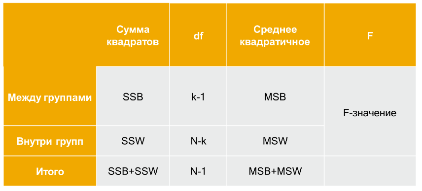

Основной в дисперсионном анализе является статистика $F$, показываются соотношение между межгрупповой и внутригрупповой дисперсиями. Если межгрупповая дисперсия существенно выше, чем внутригрупповая, то между изучаемыми группами (уровнями) существуют статистически значимые различия.

$$F=\frac{MS_b}{MS_w}$$

::: {#fig-anova}


Межгрупповая и внутригрупповая дисперсии
:::

#### Множественные сравнения (post hoc tests – апостериорные тесты)

Сам по себе дисперсионный анализ показывает, что есть различия хотя бы между одной парой средних значений (наличие общего эффекта). Но между какими именно группами? Обычно на вычислении $F$ все не заканчивается, а только начинается.

Первое, что может прийти в голову: почему бы не сравнить группы попарно с помощью того же t-критерия? Однако, все не так просто, поскольку когда групп много, возникает проблема одновременной проверки множественных гипотез.

Вкратце, эта проблема заключается в том, что при одновременной проверке большого числа гипотез на том же наборе данных вероятность сделать неверное заключение в отношении хотя бы одной из этих гипотез значительно превышает изначально принятый уровень значимости ($\alpha$).

Так, если мы будем сравнивать десять групп по тридцать испытуемых в каждой, то мы практически всегда найдем отличие лучшей группы от худшей на уровне значимости меньше 0.05, даже если группы эти набирались совершенно случайно и ни о каком воздействии, которое могло бы привести к систематическому сдвигу среднего значения, речи не шло. Например, вы можете сравнить пассажиров десяти вагонов поезда по тесту, измеряющему социальную дистанцию к какой-либо группе и убедиться, что значимость отличия лучшего вагона от худшего по Т-критерию, как правило, меньше 0.05.

Можно сказать, что 10(10−1)/2 (число сочетаний из 10 по 2) попарных сравнений «всех со всеми» практически гарантируют хотя бы одну ошибку первого рода, т.е. отвержение гипотезы $H_0$, когда она на самом деле верна.

Когда мы сравниваем три группы (например, А и В, А и С, В и С), вероятность совершить ошибку хотя бы в одном из этих трех сравнений составит:

$$P' = 1 - (1 - \alpha)^m =  1- (1 - 0.05)^3 = 0.143,$$ Если же количество сравнений 45, как в примере с 10 вагонами (10\*9/2=45), то вероятность ошибки начинает превышать 90%:

$$P' = 1 - (1 - \alpha)^m =  1- (1 - 0.05)^{45} = 0.90,$$

Что делать?

Для устранения эффекта множественных сравнений существует большой репертуар методов, позволяющих снизить вероятность ошибочного решения. Они различаются как своей консервативностью, так и условиями применения.

Одним из самых простых и известных способов контроля над групповой вероятностью ошибки является *Метод Бонферрони* (назван так в честь предложившего его итальянского математика Карло Эмилио Бонферрони; Carlo Emilio Boferroni). Он заключается в умножении полученных при сравнении групп p-значений на количество сравниваемых групп.

>  **Пример**: Предположим, Предположим, что мы применили определенный статистический критерий 3 раза (например, сравнили при помощи критерия Стьюдента средние значения групп А и В, А и С, и В и С) и получили следующие три Р-значения: 0.01, 0.02 и 0.005. Чтобы применить метод Бонферрони, мы должны умножить каждое из p-значений на 3, а затем сравнить с выбранным уровнем значимости:
>
> -   0.01 \* 3 = 0.03 \< 0.05: гипотеза отклоняется;
> -   0.02 \* 3 = 0.06 \> 0.05: гипотеза принимается;
> -   0.005 \* 3 = 0.015 \< 0.05: гипотеза отклоняется.

Хотя метод Бонферрони очень прост в реализации, он обладает одним существенным недостатком: при возрастании числа проверяемых гипотез мощность этого метода резко снижается. Другими словами, при возрастании числа гипотез нам будет все сложнее и сложнее отвернуть даже те из них,которые должны быть отвергнуты. Например, при проверке 10 гипотез, применение поправки Бонферрони привело бы к снижению исходного уровня значимости до 0.05/10 = 0.005. Соответственно, для отклонения той или иной гипотезы, соответствующие Р-значения должны были бы оказаться меньше 0.005, и такого условия достичь маловероятно. В связи с этим метод Бонферрони не рекомендуется использовать, если число проверяемых гипотез превышает 7-8.

Для преодоления проблем, связанных с низкой мощностью метода Бонферрони, в 1978 г. Стур Холм (Holm 1978) предложил гораздо более мощную его модификацию (часто этот метод называют еще методом Холма-Бонферрони). Этот модифицированный метод основан на алгоритме, который включает следующие шаги:

-   Исходные Р-значения упорядочиваются по возрастанию: $p_{(1)} \leq p_{(2)} \leq \dots \leq p_{(m)}$. Эти Р-значения соответствуют проверяемым гипотезам $H_{(1)}, H_{(2)}, \dots H_{(m)}$.
-   Если $p_{(1)} \geq \alpha/m$, все нулевые гипотезы $H_{(1)}, H_{(2)}, \dots H_{(m)}$ принимаются и процедура останавливается. Иначе следует отвергнуть гипотезу $H_{(1)}$ и продолжить.
-   Если $p_{(2)} \geq \alpha/(m-1)$, нулевые гипотезы $H_{(2)}, H_{(3)}, \dots H_{(m)}$ принимаются и процедура останавливается. Иначе гипотеза $H_{(2)}$ отвергается и процедура продолжается.
-   ...
-   Если $p_{(m)} \geq \alpha$, нулевая гипотеза \$H\_{(m)} принимается и процедура останавливается.

Описанную процедуру называют *нисходящей* (англ. step-down): она начинается с наименьшего P-значения в упорядоченном ряду и последовательно «спускается» вниз к более высоким значениям. На каждом шаге соответствующее значение $p_{(i)}$ сравнивается со скорректированным уровнем значимости $\alpha / (m+i-1)$. Как и в случае с поправкой Бонферрони, вместо корректировки уровня значимости мы можем скорректировать непосредственно Р-значения - конечный результат (в смысле принятия или отклонения той или иной гипотезы) окажется идентичным. Соответствующая поправка выполняется в виде $q_i = p_{(i)} (m + i -1)$. Так, для рассмотренного выше примера с тремя Р-значениями получаем:

-   $q_1 = p_{(1)}(m - 1 + 1) = 0.005*3 = 0.015$
-   $q_2 = p_{(2)}(m - 2 + 1) = 0.01*2 = 0.02$
-   $q_3 = p_{(2)}(m - 3 + 1) = 0.02*1 = 0.02$

Именно последний подход реализован в R-функции p.adjust():

```{r}
# Скорректированные Р-значения:
p.adjust(c(0.01, 0.02, 0.005), method = "holm")
```

На практике, в различных программах статистической обработки данных используются разные критерии для множественных сравнений.

Так, **критерии диапазона** выявляют однородные подмножества средних, не различающихся между собой. **Парные множественные сравнения** проверяют разности между каждой парой средних значений и выдают матрицу, в которой звездочками обозначены групповые средние, значимо различающиеся на уровне $\alpha$.

Если требование о равенстве дисперсий выполняется, то рекомендуется использовать такие апостериорные тесты как **Тьюки-b**, С-Н-К (Стьюдента-Ньюмена-Келса), **Дункана**, Р-Э-Г-У F ( F-критерий Райана-Эйнота-Габриэля-Уэлша), Р-Э-Г-У Q (критерий диапазона Райана-Эйнота-Габриэля-Уэлша) и Уоллера-Дункана, Бонферрони, **Тьюки LSD**, Шидака, Габриэля, Гохберга, Даннетта, Шеффе и НЗР (наименьшей значимой разности).

Если требование о равенстве дисперсий не выполняется: Тамхейна T2, Даннетта T3, **Геймса-Хоуэлла** и Даннетта C.

Продолжим наш пример с климатическими данными, однако, на этот раз, разделим выборку не на две, а на три возрастные группы, используя уже имеющуюся в наборе переменную `age_cat3`.

Поскольку нам нужна факторная переменная, прежде всего восстановим метки значений для этой переменной:

```{r}
df$age_cats3<-sjlabelled::as_label(df$age_cats3)
```

Проведем тест на гомогенность дисперсий (тест Ливиня из библиотеки `rstatix` - не забываем, что ее нужно предварительно установить):

```{r}
df %>% 
  rstatix::levene_test(V18_mean ~ age_cats3)
```

Тест показывает отсутствие значимых различий, а значит, мы можем использовать «обычную» практику расчетов, в ппротивномслучае было бы лучше воспользоваться специальной формулой Уэлча, которая есть и для дисперсионного анализа.

Проведем дисперсионный анализ, используя функцию `anova_test` из уже упомянутого пакета `rstatix`. В качестве аргумента мы должны задать формулу: `V18_mean ~ age_cats3`, означающую, что мы хотим исследовать зависимость значений `V18_mean` от уровней факторной переменной `age_cats3`:

```{r}
res.aov <- df %>% rstatix::anova_test(V18_mean ~ age_cats3)
res.aov

```

Значение `F` составило 7,29, весьма далеко от случайного отклонения:

```{r echo=FALSE}
library(nhstplot)
plotftest(f = 7.29, dfnum = 2, dfdenom = 857)
```

```{r}
pwc <- df %>% rstatix::tukey_hsd(V18_mean ~ age_cats3)
pwc
```

Визуализация результатов (первый вариант):

```{r}
#| label: fig-one-way-anova1
#| fig-cap: "Визуализация результатов однофакторного дисперсионного анализа (ggpubr)"
# Прежде, чем создать визуализацию, создадим список пар групп, которые будем сравнивать
my_comparisons <- list( c("До 30 лет", "31-49 лет"), c("До 30 лет", "50 лет и старше"), c("31-49 лет", "50 лет и старше"))
df %>% 
  filter(!is.na(age_cats3)) %>% 
  ggviolin(x = "age_cats3", y = "V18_mean",
          color = "age_cats3", fill = "age_cats3", add = "boxplot", add.params = list(fill = "white"), palette = "jco",  xlab = "Возраст", ylab = "Оценка важности сохранения \n традиционных основ жизнедеятельности", legend.title = "Возрастные группы" )+stat_compare_means(comparisons = my_comparisons)
```

Визуализация результатов (вариант c помощью пакета `ggstatsplot`). Отметим, что по умолчанию функция основывается на предположении об отсутствии равенства дисперсий и использует критерий Геймса-Хоуэлла, поэтому результаты отличаются p-значениями, но общий вывод не меняется: основные различия пролегают между оценками младшей группы и всеми остальными.

```{r}
#| label: fig-one-way-anova2
#| fig-cap: "Визуализация результатов однофакторного дисперсионного анализа (ggstatsplot)"
library(ggstatsplot)
ggbetweenstats(
  df,
  x    = age_cats3,
  y    = V18_mean,
  type = "parametric",
  xlab = "Возраст"
)
```

### Однофакторный непараметрический дисперсионный анализ Краскела-Уоллиса

Адекватное применение дисперсионного анализа основывается на допущении о том, что зависимая переменная является непрерывной, имеет нормальное распределение и достаточно большую выборку (желательно $n_j> 30$ где $j=1, 2, ..., k$, а $k$ обозначает количество независимых сравниваемых групп). Дополнительно, ANOVA требует равенства дисперсий в сравниваемых выборках. Этот метод достаточно устойчив к отклонением, если выборки небольшие, но одинаковые. Когда есть проблемы с нормальностью или выборки маленькие и неравные, а также когда данные измерены в порядковой шкале, лучше использовать непараметрический аналог

Одним из часто используемых непараметрических аналогов, позволяющих сравнить более двух независимых группn, является критерий Краскела-Уоллиса (Kruskal Wallis test). Этот тест сравнивает распределения в k группах (k \> 2), при этом исходные данные также заменяются рангами. Является обобщением U-критерия Манна-Уитни для количества групп более двух.

Нулевая и альтернативная исследовательские гипотезы формулируются следующим образом:

-   $H_0$: Медианы в $k$ группах населения являются равными
-   $H_1$: Медианы в $k$ группах не равны

Процедура тестирования предполагает проведение следующих шагов:

1)  сведение всех $k$ выборок в один комбинированный набор
2)  ранжирование всех значений от 1 до $N$, где $N = n_1+n_2 + ...+ n_k$ и присвоение рангов
3)  подсчет суммы рангов в каждой группе
4)  вычисление статистики критерия
5)  определение уровня значимости и формулировка вывода.

Требования

1.  Выборки являются случайными.
2.  Наблюдения не зависят друг от друга
3.  Как минимум порядковый уровень измерения для зависимой переменной и порядковый или номинальный – для независимого фактора.
4.  Нет требований о характере распределения или нормальности данных.

Формула для расчета H-критерия Краскела-Уоллиса:

$$H=\frac{12}{N(N+1)}\Sigma^k_{i=1}\frac{R^2_i}{n_i}-3(N+1)$$

где:

-   $k$ количество сравниваемых групп
-   $N$ - общий объем выборки
-   $n_i$ - объем выборки в группе $i$
-   $R_i$ - сумма рангов в группе $i$.

```{r}
kruskal.test(V18_mean ~ age_cats3, data = df)
```

Мы также можем сделать парные сравнения:

```{r}
pairwise.wilcox.test(df$V18_mean, df$age_cats3,  p.adjust.method = "BH")
```

```{r}
#| label: fig-h-test
#| fig-cap: "Визуализация результатов непараметрического однофакторного дисперсионного анализа (ggstatsplot)"
library(ggstatsplot)
ggbetweenstats(
  df,
  x    = age_cats3,
  y    = V18_mean,
  type = "non-parametric",
  xlab = "Возраст"
)
```

## Анализ зависимых выборок

Напомним, что зависимые (иногда их еще называют связанные, парные) выборки представляют собой данные, в которых каждому наблюдению в одном датасете соответствует другое, связанное с ним наблюдение в другом наборе данных.

Например, могут сравниваться:

-   измерения в разные периоды времени (до и после лечения, обучения, смены работы и пр.)
-   условия, в которых были проведены измерения (лекарство натощак или после завтрака, выполнение теста с предварительным тренингом и без, результаты адаптации мигрантов через программу интеграции и без нее и др.)
-   результаты разных измерений (разные тесты тревожности, например)
-   спаренные пары, имеющие сходные характеристики (например, при сравнении результатов различных образовательных программ).

Для анализа результатов таких исследований требуются особые статистические методы, которые мы будем обсуждать в данном разделе.

::: {#fig-paired-samples}


Связь между наблюдениями в зависимых выборках. Источник: www.statology.org
:::

### t-критерий для зависимых выборок

Аналогично ситуациям, рассмотренным выше, t-критерий для зависимых выборок также используется для того, чтобы сравнить средние значения, но при этом предполагается, что группы связаны друг с другом каким-то образом. Чаще всего речь идет об одних и тех же испытуемых (респондентах, наблюдениях), у которых измеряется один и тот же показатель через некоторый промежуток времени. Однако, это могут быть и разные люди (объекты исследования), но выборки все равно проектируются как связанные.

::: {#fig-ttest}
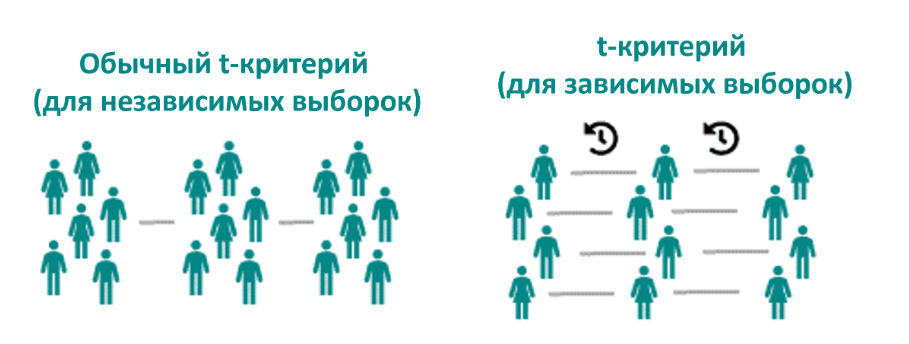{width="50%"}

Отличия между различными критериями
:::

Будучи параметрической процедурой, в которой оцениваются неизвестные параметры, t-критерий основывается на некоторых допущениях, проверка которых обычно осуществляется перед проверкой статистических гипотез. Поскольку речь идет о зависимых выборках, в качестве наблюдений учитываются не исходные данные, а различия между двумя наборами значений, и каждое допущение касается именно этих различий, а не исходных данных. Таких допущений четыре:

-   Зависимая переменная должна быть непрерывной (интервальная шкала / шкала отношений). В отдельных случаях могут использоваться дискретные шкалы (например, в ходе измерения социальных установок с помощью шкал Лайкерта).

-   Наблюдения должны быть независимы друг от друга (различия между парами по одной строке не должны зависеть от различий по другим строкам).

-   Зависимая переменная (то есть различия между значениями) должна иметь нормальное распределение.

-   У зависимой переменной не должно быть выбросов.

Как всегда, формулируем гипотезы:

$H_0:μ_d=0$ – разница в средних значениях двух спаренных выборок равна нулю

$H_1:μ_d≠0$ - (двухсторонний) разница в средних значениях двух выборок – не равна нулю $H_1:μ_d>0$ - (правосторонний) – разница больше нуля

$H_1:μ_d>0$ - (левосторонний) – разница меньше нуля

**Порядок вычислений**:

-   Посчитать различия в значениях между двумя измерениями – $D$
-   Посчитать среднее значение получившихся различий $d_1, d_2, … , d_n$:

$$\bar{d}=\frac{d_1+d_2+...+ d_n}{n}$$ - Посчитать значение t-критерия по формуле:

$$t = \frac{\bar{d}}{s/\sqrt{n}},$$ где $s$ - стандартное отклонение различий ($d$), $n$ - объем выборки (количество пар значений, по которым высчитываются $d$)/

Далее мы можем вычислить p-значение для абсолютного значения статистики критерия ($|t|$) на основе сведений о количестве степеней свободы ($df$): $df=n−1$ (приблизительно с помощью таблиц критических значений или точно на основе специальной программы).

>  **Пример**: Одной из извечных российских проблем являются дороги. Для повышения безопасности и комфорта дорожного движения созден специальный национальный проект - «Безопасные качественные дороги», постоянно проводятся профилактические мероприятия, направленные на повышение уровня информированности граждан о правилах дорожного движения, ответственности и сознательности, как водителей, так и пешеходов. Допустим, мы хотели бы выяснить, как меняется ситуация на дорогах, происходит ли снижение количества погибших в ДТП за последние пять лет.

[Скачать данные](https://github.com/domelia/rcourse/blob/main/dtp.xls)

Загрузим данные Росстата о количестве погибших в ДТП на 100 тыс. населения:

```{r}
library(readxl)
dtp<-read_excel("dtp.xls")
```

Вычислим различия между двумя рядами значений и сделаем проверку на нормальность - графически и с помощью теста Шапиро-Уилка.

```{r}
names(dtp)<-c("region", "dtp2018", "dtp2023")
dtp$d<-dtp$dtp2018-dtp$dtp2023
# Сделаем гистограмму
hist(dtp$d)
shapiro.test(dtp$d)
```

Да, пока результаты не радуют, мы видим, что есть существенные отклонения от нормальности. Если посмотреть на данные, то можно увидеть, что ситуацию осложняет Республика Калмыкия, где произошло большое увеличение количества ДТП. Попробуем убрать этот регион и посмотреть, что получится.

```{r}
library(dplyr)
dtp2<-dtp %>% 
  filter(region!="Республика Калмыкия")
hist(dtp2$d)
shapiro.test(dtp2$d)
```

Совсем другое дело!

В нашей таблице данные не совсем «чистые», один и тот же показатель указан в двух столбцах, однако такая ситуация встречается довольно часто.

В целом, функция останется прежней, но к ней добавится аргумент `paired = TRUE`, который и позволит провести измерения с зависимыми выборками:

```{r}
res <- t.test(dtp2$dtp2018, dtp2$dtp2023, paired = TRUE) 
res
```

Поскольку мы сравниваем 2018 год и 2023, то положительная средняя разница означает, что в среднем количество погибших в ДТП сокращается. Статистика t-критерия (8,67) при количестве степеней свободы 84 указывает на достоверные различия (p\<0,001).

Для того, чтобы визуализировать отличия, переструктурируем наши данные в «длинный формат» таким образом, чтобы вся информация о ДТП была в одном столбце, а период, в который собирались статистические данные, - в другом.

```{r}
library(tidyr)
dtp3<-dtp2 |>  
  pivot_longer(cols=dtp2018:dtp2023, 
names_to="year",
values_to = "dtp_number")
```

Воспользуемся функцией `ggwithinstats` из пакета `` ggstatsplot`, чтобы отобразить различия между периодами: ``

```{r}
library(ggstatsplot)
ggwithinstats(
  data = dtp3,
  x = year,
  y = dtp_number
)
```

### Критерий Уилкоксона для зависимых выборок

Если все же проблемы с распределением непреодолимы или данные не являются непрерывными, лучше воспользоваться непараметрическим аналогом для зависимых выборок - критерием знаковых рангов Уилкоксона.

Выше мы уже разбирали формулу данного критерия, здесь же подчеркнем, что мы будем сравнивать два распределения, соответствующие одной и той же группе респондентов (объектов, наблюдений).

::: {#fig-Wpaired}
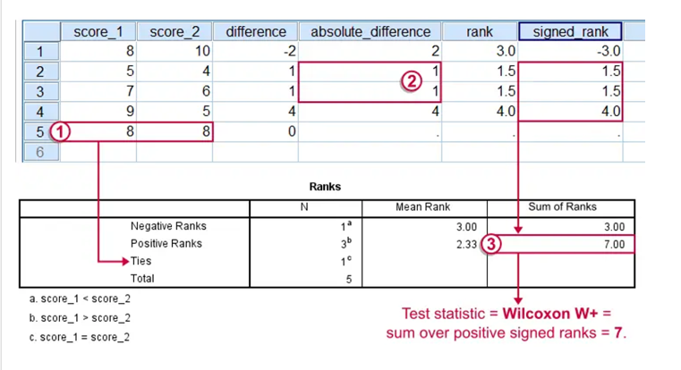 Графическое представление теста Вилкоксона.
:::

Применим тест Уилкоксона для анализа данных о погибших в ДТП. Попробуем воспроизвести все действия вручную:

```{r}
dtp2$rank<-rank(abs(dtp2$d),  ties.method = "average")# посчитаем ранги
dtp2$sign<-sign(dtp2$d)#найдем знак различий
dtp2$signed_ranks<-dtp2$rank*dtp2$sign#умножим ранги на знак
```

Посчитаем сумму положительных рангов:

```{r}
dtp2 %>% 
  filter(signed_ranks>0) %>% 
  summarise(sum_ranks=sum(signed_ranks))
```

В R мы можем использовать знакомую уже нам функцию `wilcox.test()`, но указываем аргумент `paired=TRUE`.

```{r}
wilcox.test(dtp2$dtp2018, dtp2$dtp2023, paired = TRUE, alternative = "two.sided")
```

Визуализируем это:

```{r}
ggwithinstats(
  data = dtp3,
  x = year,
  y = dtp_number,
  type = "non-parametric"
)
```

### ANOVA с повторными измерениями

Дисперсионный анализ с повторными измерениями расширяет идею t-критерия для зависимых выборок на случай, когда количество сравниваемых групп превышает две.

Вычисления сходны с теми, что мы рассматривали на примере «обычной» однофакторной ANOVA.

Различия будут заключаться в том, как мы будем подсчитывать среднюю межгрупповую сумму квадратов отклонений, для повторных измерений у в качестве группирующей переменной будет использоваться фактор времени:

$$F=\frac{MS_{time}}{MS_{error}}$$

или фактор условия: $$F=\frac{MS_{condition}}{MS_{error}}$$

Например, мы хотим сравнить значения, соответствующие различным временным отрезкам.

Тогда разница группового (внутри отдельных временных диапазонов) и общего среднего составит:

$$S_{time}=SS_b=\sum_{i=1}^{k}(\bar{x_i}-\bar{x})^2$$ Разница индивидуальных значений и групповых средних:

$$SSw=\sum_{1}(x_{i1}-\bar{x_1})^2+\sum_{2}(x_{i2}-\bar{x_2})^2+ ... + \sum_{k}(x_{ik}-\bar{x_k})^2$$ Разница средних по всем измерениям и общего среднего, k – количество уровней:

$$SS_{subjects}=k*\sum(\bar{x_i}-\bar{x})^2$$

Сумма квадратов ошибки:

$$SS_{error}=SS_w-SS_{subjects}$$

Тогда средний квадрат отклонений по времени будет:

$$MS_{time}=\frac{SS_{time}}{k-1}$$ Соответственно, будет определяться и средняя ошибка:

$$MS_{error}=\frac{SS_{error}}{(n-1)(k-1)}$$

Рассмотрим возможности применения данного метода на следующем примере:

> **Пример**: В исследовании изучалось влияние на восприятие алкогольных напитков различной информации. Сравнивались три напитка – вода, вино и пиво. Участники эксперимента смотрели положительные, нейтральные и негативные информационные материалы, а затем оценивали свое отношение к напитку по шкале от -100 до 100.

[Скачать данные](https://github.com/domelia/rcourse/blob/main/Alcohol_Attitudes.csv)

::: {#fig-beer layout-ncol="2"}
{#fig-beer1} {#fig-beer2}

Примерно так могли выглядеть информационные материалы эксперимента
:::

```{r}
alcohol_attitudes<-read.csv("Alcohol_Attitudes.csv")
```

Наши данные представлены в «широком» формате, переведем их в длинный, оставив только переменные, касающиеся пива:

```{r}
alc_long<-alcohol_attitudes |>   
  select(participant, contains("beer")) |>  
  pivot_longer(cols=contains("beer"), names_to = "emotion", values_to = "score")
```

Посмотрим описательные статистики по группам:

```{r}
alc_long |> 
  group_by(emotion) |> 
  summarise(n=n(), mean=mean(score), sd=sd(score))
```

Видим, что оценки разные и следуют логике увеличения по мере смены эмоции с негативной на позитивную.

Сделаем проверку на нормальность:

```{r}
library(rstatix)
alc_long |> 
  group_by(emotion) |> 
  shapiro_test(score)
```

Видим, что в группе с негативной эмоцией есть отклонения от нормальности, но мы пока закроем на это глаза.

Сопроводим графической проверкой:

```{r}
ggqqplot(alc_long, "score", facet.by = "emotion")
```

```{r}
res.aov <- anova_test(data = alc_long, dv = score, wid=participant, within = emotion)
get_anova_table(res.aov)
```

Результаты показывают, что оценки отношения к напитку были статистически различными в разных условиях эксперимента, F(2, 38) = 17.57 p \< 0.001, однако обобщенная величина эффекта не очень велика eta2\[g\] = 0.21.

Проведем парные сравнения:

```{r}
pwc <- alc_long |> 
  pairwise_t_test(
    score ~ emotion, paired = TRUE,
    p.adjust.method = "bonferroni"
    )
pwc
```

Различия значимы между оценками, полученными в результате предъявления позитивных материалов, и двумя другими группами (нейтральной и негативной), тогда как различия между негативными и нейтральными материалами не значимы.

Добавим результаты статистического анализа в исходный график:

```{r}
pwc <- pwc %>% add_xy_position(x = "emotion")
bxp + 
  stat_pvalue_manual(pwc) +
  labs(
    subtitle = get_test_label(res.aov, detailed = TRUE),
    caption = get_pwc_label(pwc)
  )
```

Ну, или вот так:

```{r}
ggwithinstats(
  data = alc_long,
  x = emotion,
  y = score
)
```

### Критерий Фридмана - непараметрический аналог дисперсионного анализа для зависимых выборок

Тест Фридмана – разработан Милтоном Фридманом, американским экономистом и нобелевским лауреатом.

::: {#fig-friedman}


Милтон Фридман - нобелевский лауреат за исследования в области потребления, монетаризма и политики стабилизации
:::

Является аналогом ANOVA с повторными измерениями и непараметрического дисперсионного анализа для связанных выборок.

Алгоритм следующий:

-   представить данные в виде матрицы \$ {x\_{ij} }\_{n\*k}\$ с $n$ количеством строк и $k$ количеством столбцов
-   заменить исходные значения на ранги ($r$) по каждой строке.
-   посчитать сумму рангов ($R$) по каждому столбцу
-   подставить значения в формулу:

$$Q=\frac{12}{N*k*(k+1)}*\sum R^2+(3*N*(k+1))$$

-   В тех случаях, когде $n$ или $k$ достаточно большие (например, $n>15$ или $k>4$ статистика критерия может быть аппроксимирована распределением $\chi^2$. Если $n$ или $k$ маленькие, статистика $\chi^2$ может быть некорректной и лучше воспользоваться специальными таблицами.

```{r}
res.fried <- alc_long %>% friedman_test(score ~ emotion |participant)
res.fried
```

Для определения величины эффекта можно воспользоваться критерием W Кендалла:

$$W=\frac{Q}{N(k-1)},$$

где $Q$ - статистика теста по Фридману, $N$ объем выборки, $k$ количество измерений по каждому субъекту (M. T. Tomczak and Tomczak 2014).

Значение коэффициента $W$ может принимать значения от 0 (отсутствие взаимосвязи между оценками и уровням измерений) до 1 (тесная взаимосвязь).

Интерпретация коэффициента аналогична $d$ Коэна:

-   0.1 - \< 0.3 (маленький эффект)

-   0.3 - \< 0.5 (средний эффект)

-   

    > = 0.5 (большой эффект).

Доверительные интервалы рассчитываются с помощью бутстрэпа (многократного расщепления выборки на наборы данных).

```{r}
alc_long %>% friedman_effsize(score ~ emotion |participant)
```

В данном случае наблюдается средний эффект.

Проведем парные сравнения с помощью теста Уилкоксона:

```{r}
pwc <- alc_long %>%
  wilcox_test(score ~ emotion, paired = TRUE, p.adjust.method = "bonferroni")
pwc
```

Результаты аналогичны тем, что были найдены в ходе применения параметрических процедур.

Визуализируем это:

```{r}
pwc <- pwc %>% add_xy_position(x = "emotion")
ggboxplot(alc_long, x = "emotion", y = "score", fill="emotion", add = "point") +
  stat_pvalue_manual(pwc) +
  labs(
    subtitle = get_test_label(res.fried,  detailed = TRUE),
    caption = get_pwc_label(pwc)
  )
```

Второй вариант визуализации:

```{r}
ggwithinstats(
  data = alc_long,
  x = emotion,
  y = score,
  type="non-parametric"
)
```

## Анализ качественных данных

Рассмотрев случаи, когда зависимая переменная являлась количественной, перейдем к большому классу исследовательских ситуаций, когда мы исследуем взаимосвязи между категориальными показателями.

К слову, это огромное количество случаев, встречающихся в ходе анализа социологических данных.

### Сравниваем независимые группы

#### Одновыборочный z-критерий: сравниваем значение одной доли с теоретическим

Проводя социологическое исследование, мы можем быть заинтересованы в том, чтобы сравнить результаты, полученные на нашей выборочной с какими-либо предполагаемыми результатами, выраженными в виде пропорции.

> **Пример**: Мы исследуем оценки жителей одного из городских кварталов относительно того, согласны ли они, чтобы рядом с их домами оборудовали большой парк, с велодорожками и прочими благами цивилизации. В этот же момент времени предполагается благоустройство и других объектов, поэтому городские власти бы выбрать именно этот объект для инвестиций, но только в том случае, если оценки населения будут благоприятны и составят не менее 70%. Проведя опрос среди 500 жителей мы обнаружили, что 370 из них выразили согласие с обустройством парка, тогда как 130 человек по каким-то причинам были против парка. Превышает ли количество жителей допустимый предел?

Помочь в решении нашей задачи может z-критерий для одной пропорции.

Как и в других случаях мы сформулируем гипотезы:

Нулевая гипотеза:

-   $H_0:p_o=p_e$

Альтернативные гипотезы:

-   $H_1:p_o\neq p_e$
-   $H_1:p_o>p_e$
-   $H_1:p_o<p_e$

Статистика критерия:

$$z = \frac{p_o-p_e}{\sqrt{p_oq/n}},$$

где:

-   $p_o$ наблюдаемая доля
-   $q=1−p_o$
-   $p_e$ ожидаемая доля
-   $n$ объем выборки.

```{r}
res <- prop.test(x = 370, n = 500, p = 0.7, alternative = "two.sided")
res 
```

```{r echo=FALSE}
library(nhstplot)
plotchisqtest(3.6214,1)
```

#### Сравнение двух долей (пропорций) - z-критерий

Мы можем распространить наши рассуждения на тот случай, когда нам требуется сравнить две пропорции, в каких-то группах.

В этом случае критерий несколько преображается:

$$z = \frac{p_1-p_2}{\sqrt{pq/n_1+pq/n_2}},$$ где:

-   $p_1$ доля, наблюдаемая в группе 1, имеющей размер $n_1$
-   $p_2$ доля, наблюдаемая в группе 2, имеющей размер $n_2$
-   $p$ и $q$ - общие пропорции по всей выборке
-   $q=1−p$

Допустим, мы анализируем результаты исследования по климату, и нам хотелось бы знать, как относятся к климатическим изменениям мужчины и женщины. Если точнее, считают ли мужчины более опасным проживание вблизи тающих ледников, чем женщины (или наоборот)?

```{r}
df$V1<-sjlabelled::as_label(df$V1)
prop.table(table(df$V19, df$V1), margin = 2)
```

На первый взгляд кажется, что женщины, действительно, воспринимают риски тающих ледников как более серьезные. Но как это доказать?

```{r}
library(infer)
df<-df %>% 
  mutate(V19=case_when(
    V19==1 ~ "Да",
    V19==2~"Нет"
  ))
pr_test<-prop_test(df, V19 ~ V1, order = c("Мужской", "Женский"))
pr_test
```

#### Наш любимый хи-квадрат

Критерий $\chi^2$ Пирсона – один из самых известных тестов для анализа категориальных данных. Основан на сравнении наблюдаемых и ожидаемых частот.

$$\chi^2=\sum\frac{(O-E)^2}{E},$$

Где: - $O$ - наблюдаемые значения - $E$ - ожидаемые значения (которые были бы в том случае, если бы никакой взаимосвязи между частотами не было)

Гипотезы:

-   $H_0$ – между зависимой и независимой переменной нет взаимосвязи – наблюдаемые частоты не отклоняются от ожидаемых частот.
-   $H_1$- между зависимой и зависимой переменной есть взаимосвязь, наблюдаемые частоты значимо отклоняются от ожидаемых.

**Условия применения статистического критерия хи-квадрата Пирсона**

-   Тип данных: параметры должны быть качественными целочисленными частотами, измеренными в номинальной шкале:
    -   бинарными (пол: мужской/женский) или с большим количеством градаций (регион, группа - обучения, специальность)
    -   порядковыми (степень артериальной гипертензии)
-   Количество наблюдений более 20
    -   Ожидаемая частота, соответствующая нулевой гипотезе должна быть более 5, если ожидаемое явление принимает значение менее 5, то необходимо использовать точный Критерий Фишера.
    -   Для четырехпольных таблиц (2х2): Если ожидаемое значение принимает значение менее 10 (а именно 5\<x\<10), необходим расчет поправки Йетса.
-   Сравниваемые группы должны быть примерно одного размера.
-   Сопоставляемые группы должны быть независимыми (то есть единицы наблюдения не зависят друг от друга). Для парных сравнений (типа «до-после» существует отдельный тест МакНемара (McNemar).

::: {callout-important}
Запрещается: использовать хи-квадрат для анализа непрерывных абсолютных данных, процентов и долей без предварительной перекодировки!
:::

```{r}
chisq.test(df$V1, df$V19)
```

Одной из наиболее удачных идей визуализации таблиц сопряженности являются мозаичные диаграммы:

```{r}
library(vcd)
 options(OutDec= ",") 
#создадим базовую таблицу
M<- table(df$V19, df$V1)
#подпишем оси
names(dimnames(M)) = c("Опасны ли тающие ледники?","Пол")
#создадим таблицу с надписями
labs <- round(prop.table(M,margin=2)*100, 1)
#обычная мозаичная диаграмма
mosaic(M, pop = FALSE, shade = TRUE)
#добавим значения в ячейках
labeling_cells(text = labs, margin = 0)(M)
```

Еще один вариант - ассоциативный (структурный) график:

```{r}
struct <- structable(~ V19 + V1, data = df)
assoc(struct, data = df, shade=T, labeling_args = list(set_varnames = c(V1 = "Пол", V19="Опасны ли тающие ледники?")))
```

### Сравнение зависимых выборок

#### Тест МакНемара

Тест Макнемара используется для определения наличия статистически значимой разницы в пропорциях для парных номинальных данных, представленных в таблицах 2 × 2.

Назван в честь **Куинна Майкла Макнемара** (1900 –1986), американского психолога и статистика, президента Американской психологической ассоциации (1964), разработавшего критерий в 1947 году.


**Тест МакНемара. Формула и процедура оценки**

::: {#fig-mc_table}
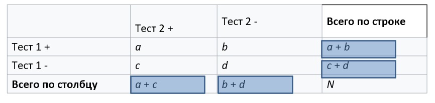

Типичная таблица для проведения теста МакНемара
:::

Тест основывается на нулевой гипотезе ($H_0$) о маргинальных частотах: маргинальные вероятности для каждого исхода равны:

$p_a + p_b = p_a + p_c$ и $p_c + p_d = p_b + p_d$.

-   $H_0: p_b=p_c$
-   $H_1: p_b\neq p_c$

$$\chi^2=\frac{(b-c)^2}{b+c}$$

>  **Пример**: рассмотрим пример из области общественного здравоохранения. В нашем наболе содержатся данные о страховых компаниях и покрытиях страховыми полисами услуг по оказании инфузионной терапии (часто применяется при раковых заболеваниях). Вопрос: меняется ли количество страховщиков, включающих в полис данную услугу?

[Скачать данные](https://github.com/domelia/rcourse/blob/main/dataset-him-2014-2016-subset2.Rdata)

Загрузим данные:

```{r}
load("dataset-him-2014-2016-subset2.Rdata")

```

Создадим таблицу по данным 2014 и 2016 гг.:

```{r}
table_for_McNemar <-table(data$X.2014, data$X.2016c)
table_for_McNemar

```

Довольно заметно, что количество страховых компаний, покрывающих своими полисами инфузионную терапию за два года выросло довольно существенно: 105 компаний, которые в 2014 году отказывались от этой опции, в 2016 году включили ее в список услуг. Обратная ситуация встречается в два раза реже: только 54 организации, которые в 2014 году оплачивали стоимость инфузионной терапии по страховке, в 2016 году отказались это делать.

Проведем тест МакНемара:

```{r}
mcnemar.test(table_for_McNemar)
```

Тест показывает наличие значимых отличий.

#### Тест Кохрана

Если количество сравниваемых групп больше двух, то используется расширение теста Макнемара - Q-критерий Кохрана.

Нулевая гипотеза ($H_0$): доли (пропорции) «успеха» во всех группах равны. Предполагается, что данные организованы в «блоки». «Блоками» могут быть, например, отдельные люди.

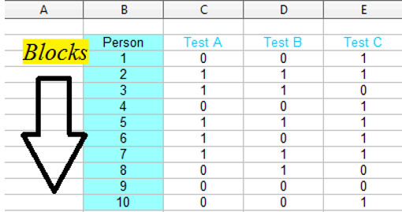

Формула теста:

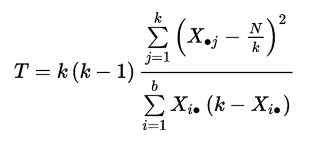 где:

-   $b$ = количество блоков,
-   $k$ = количество условий,
-   $X•j$ = сумма по столбцу для условия j,
-   $Xi•$ = сумма по строке для блока i
-   $N$ = общая сумма.

Продолжим работу с предыдущим примером.

Переведем данные из широкого в длинный формат и отберем данные без :

```{r}
data<-data %>% 
  select(-ends_with("c")) %>% 
  pivot_longer(cols = contains("X."), values_to = "outcome", names_to = "year")
```

Проведем тест Кохрана:

```{r}
cochran_qtest(data, outcome ~ year|IssuerId)
```

Выявлены значимые различия между периодами. Но какие? Как и всегда с множеством групп, необходимы парные сравнения.

Сделаем сначала общую таблицу по трем периодам:

```{r}
data %>% 
  group_by(year, outcome) %>% 
  summarise(sum=n()) %>% 
  pivot_wider(names_from = outcome, values_from = sum)
```

Теперь проведем парные сравнения, с помощью теста МакНемара:

```{r}
pairwise_mcnemar_test(data, outcome ~ year|IssuerId)
```

Результаты сравнительного анализа показывают, что наиболее важный скачок произошел в 2015 году, когда количество организаций увеличилось на 58, в последующий год их количество даже сократилось, но это сокращение не является статистически значимым.

## Самостоятельная работа

1.  Проанализируйте различия в оценках уверенности в нахождении заработка в случае потери актуального места работы (вопрос В21) в зависимости от образовательного уровня респондента (вопрос А6), перекодировав его в две категории - те, кто имеют высшее образование, и кто его не имеет.
2.  Используя созданную переменную важности соблюдения традиций, проведите анализ по уровню образования (по переменной, созданной в упр.1) и по самооценке материального положения (вопрос А10), создав три категории - «низкие доходы», «средние доходы» и «высокие доходы, обеспеченные граждане». Используйте параметрические методы там, где это уместно, и непараметрические там, где возможно применение только таких методов. Обязательно создайте визуализации к вашим результатам.
3.  Провести анализ оценки лиц, придерживающихся определенной диеты, за три промежутка времени, используя параметрический ANOVA и его непараметрический аналог с парными сравнениями. Сделать соответствующие визуализации.

Данные:

```{r eval=FALSE}
library(datarium )
data("selfesteem")

```

4.  Провести анализ таблиц сопряженности по исследованию по климату (две таблицы на ваш выбор) с помощью критерия хи-квадрат. Создать мозаичную диаграмму и ассоциативный график.

5.  Оформите ваши результаты любым удобным для вас способом и приложите в качестве ответа на задание.
